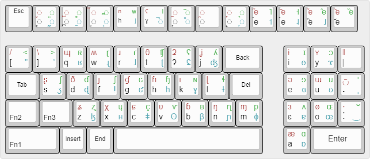

# PhonoBoard

A physical keyboard layout for the **International Phonetic Alphabet** — a 60%
board where every key carries four legends across a base layer and three
function layers, so the full IPA is reachable without menus, character pickers,
or Unicode codepoint lookup.

> **Status: archived v0.1 (2018).** This is the original design, published as-is.
> It is being revived — expect this repo to change. Nothing here is polished; it
> is the starting point, not the destination.

## The design idea

Typing IPA is normally miserable: you hunt through a character map, memorise
`U+0281`, or click symbols on a web widget. The premise here was that IPA is
already organised on a *chart*, so the keyboard should mirror that organisation
and let muscle memory do the work.

- **Consonants are grouped by phonetic feature**, not alphabetically. The `s`
  key carries `ʂ s ʃ ʒ` — the sibilant series. `d` carries `ð d ɗ ɖ`. `n` carries
  `ŋ n ɳ ɲ`. Related articulations sit under the same finger, one layer apart.
- **The vowel block is laid out like the IPA vowel quadrilateral.** The cluster
  on the right runs `ɨ i ɪ ɵ` / `ʏ y ɔ ɤ` / `ə e ɘ ɞ` / `ɯ u ʉ ʊ` / `ɜ ɛ ʌ ɐ` /
  `ø o ɶ œ` / `æ a ɑ ɒ` — close-to-open, front-to-back, positioned the way the
  chart draws them.
- **The number row holds diacritics**: voicing (`◌̬ ◌̥`), breathy and creaky voice
  (`◌̤ ◌̰`), dental/apical/laminal (`◌̪ ◌̺ ◌̻`), nasalisation, velarisation,
  release marks, plus a tone-mark cluster (`e̋ é ē è ě`) and tone bars (`˥ ˦ ˧ ˨ ˩`).
- **Suprasegmentals** — length (`ː ˑ`), stress (`ˈ ˌ`), syllable and phrase
  boundaries (`. ‖ |`) — sit near the right edge.
- **Layers are colour-coded** so the legends stay readable: base in black,
  Fn1 red, Fn2 green, Fn3 cyan.

## Contents

| Path | What it is |
|---|---|
| `layout/Phonoboard_0.1_final.json` | The layout in [keyboard-layout-editor.com](http://www.keyboard-layout-editor.com) format — paste it in to view or edit |
| `layout/Phonoboard_0.1_final.svg` / `.png` | Rendered layout |
| `layout/kle-raw.txt` | KLE raw source (legends only) |
| `layout/kle-raw-color.txt` | KLE raw source with per-layer colours |
| `reference/plate-builder-settings.png` | Plate/case parameters from the [swillkb](http://builder.swillkb.com) Plate & Case Builder — MX switches, Cherry + Costar stabilisers, sandwich case, 0.15 mm kerf for laser cutting |

## What's done and what isn't

Being straight about the state of this, because the gap matters if you try to
build from it:

- ✅ **The layout is complete** — all four layers designed, colour-coded, rendered.
- ✅ **The plate/case was specced** for laser cutting (60%, MX, sandwich).
- ❌ **There is no firmware.** The IPA keymap was never written. An old QMK
  directory survives in the authors' archive, but it is the *unmodified stock
  Satan GH60 QWERTY default* — zero IPA content — so it is deliberately not
  published here. It would only add GPL-2.0 upstream code that contributes
  nothing. Start fresh from [QMK](https://github.com/qmk/qmk_firmware) instead.
- ❓ No record that a board was ever physically assembled.

So: a finished **design**, not a working keyboard.

## If you want to make it real

The remaining work is the firmware. Mapping four legend layers onto actual IPA
output means QMK's `UNICODEMAP` feature — each layer becomes a momentary layer
(`MO()`) whose keycodes emit Unicode codepoints rather than ASCII. The layout
JSON here is the spec; every legend position corresponds to a keycode slot.

## Licence

[MIT](LICENSE) for the layout design and its source files. The IPA itself is a
standard of the International Phonetic Association.
